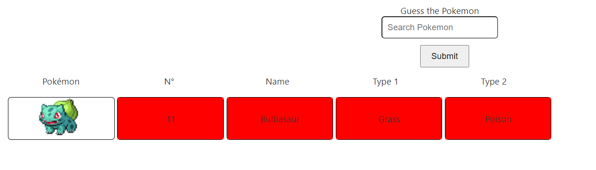
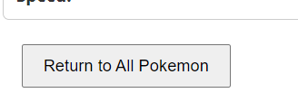

# Context
Nous devons créer un projet comprennant une partie web app et une partie API avec ElasticSearch

# Projet
## Description
Ce projet est une application web créée avec Angular, TypeScript afin de nous permettre d'utiliser plusieurs fonctionnalité d'ElasticSearch

## Liens des différentes parties
https://github.com/RemiLecas/ELK/tree/main
https://github.com/KenjiLAO/ElasticSearchBack

# Projet Front

## Prérequis 
Il faut avoir d'installé sur son poste
- Node.js
- npm ou yarn

## Récupération du projet et installation
Pour récupéré le projet front il faut aller dans un dossier puis faire la commande suivante :
- `git clone git@github.com:RemiLecas/ELK.git`

Une fois cela fais. Il faut ouvrir le projet et tapper la commande 
- `npm install`

Ceci aura pour effet d'installer toutes les dépendances nécessaires au fonctionnement du projet

## Lancement du projet 
Une fois l'étape précédentes réalisé il ne reste plus qu'a tapper la commande
- `npm run start`

Ce qui aura pour effet de lancer le projet en local

Enfin il ne reste plus qu'a ouvrir le navigateur et aller à l'adresse suivante : http://localhost:4200/

# /!\ Pour que le projet front fonctionne correctement il ne faut pas oublier de lancer l'API
Lien du repos de l'API : https://github.com/KenjiLAO/ElasticSearchBack

# Fonctionnalité présente dans le projet

## Une page pokedle. 

Un pokedle est un mini jeux ou nous devons trouver un pokemon qui à était choisi aléatoirement dans l'ensemble de tout les pokémons.

Afin de trouver le pokémon selectionner nous devons proposer un nom de pokémon dans l'input présent ce qui nous permettra d'obtenir des indices sur le pokémon choisi.

De plus, afin d'aider au mieux le joueur à trouver les nom de pokémon (puisqu'ils sont en anglais) à chaque lettres tapper dans l'input nous obtenons la liste de pokémon qui possède cette lettre.

Une fois que nous avons choisi un pokémon nous obtenons différent indice comme ceux présent ci-dessous

Lorsque nous avons réussi à trouver le bon pokémon nous obtenons une information sur le nombre d'essaie que nous avons du réalisé avant de le trouver et nous pouvons relancer un pokédle

## /!\ Quand nous partons de la page soit en naviguant dans les autres pages de l'application soit en rafraichissant la page le pokémon sélectionner change

## Une page pokédex
Si nous cliquons dans le header sur pokédex nous obtenons la liste compléte des pokémons présents dans les différents jeux (comprenant leurs différentes formes) avec toutes leurs statistiques et leurs types

Ici pour rechercher un pokémon nous devons tapper le nom complet du pokémon que l'on veut voir pour obtenir ses informations au lieu de parcourir la liste de pokémon.

Nous obtenons aussi les informations sur les différentes formes du pokémon selectionner puisqu'ils ont le même nom.

Une fois que nous avons fais une recherche nous pouvons cliquer sur le bouton ici présents pour retourner à la liste compléte des pokémons

Ce bouton ce situe tout en bas de la page

De plus, quand nous sommes sur l'affichage avec l'ensemble des pokémons nous pouvons cliquer sur les bouton "Next" et "Previous" pour voir tout les pokémons disponible puisqu'il n'y a que 20 pokémons par page

## Page des pokémons les plus recherché
Enfin il reste une dernière page qui montre les noms des pokémons les plus rechercher dans le pokedle avec leurs nombre de recherche

